 

# Choosing a figure or table

Choose a display for the comparison you want to make. Try alternatives while exploring the data: a pattern hidden by a group average may become visible when you plot the individual observations. [[4]](#ref-display-shoresh2012).

## Visual glossary

**Amounts**

<table>
<colgroup>
<col>
<col>
<col>
</colgroup>
<tbody>
<tr>
<td> Bars</td>
<td>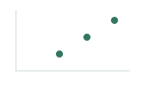 Dot plot</td>
<td>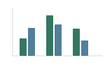 Grouped bars</td>
</tr>
</tbody>
</table>

**Distributions**

<table>
<colgroup>
<col>
<col>
<col>
</colgroup>
<tbody>
<tr>
<td>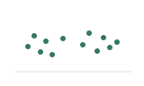 Individual points</td>
<td>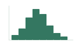 Histogram</td>
<td>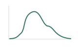 Density</td>
</tr>
</tbody>
</table>

**Distribution summaries**

<table>
<colgroup>
<col>
<col>
<col>
</colgroup>
<tbody>
<tr>
<td>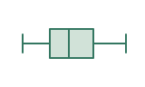 Boxplot</td>
<td> Violin</td>
<td>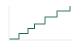 Cumulative distribution (ECDF)</td>
</tr>
</tbody>
</table>

**Matching**

<table>
<colgroup>
<col>
</colgroup>
<tbody>
<tr>
<td>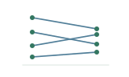 Connected points</td>
</tr>
</tbody>
</table>

**Relationships**

<table>
<colgroup>
<col>
<col>
<col>
</colgroup>
<tbody>
<tr>
<td>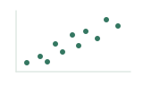 Scatterplot</td>
<td>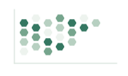 Hexbin</td>
<td> Bubble plot</td>
</tr>
</tbody>
</table>

**Time or dose**

<table>
<colgroup>
<col>
<col>
</colgroup>
<tbody>
<tr>
<td>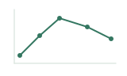 Time-course lines</td>
<td>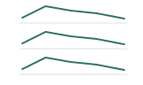 Small multiples</td>
</tr>
</tbody>
</table>

**Composition**

<table>
<colgroup>
<col>
<col>
</colgroup>
<tbody>
<tr>
<td>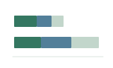 Stacked bars</td>
<td>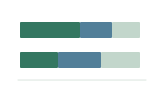 Proportional stacked bars</td>
</tr>
</tbody>
</table>

**Matrices, networks and sets**

<table>
<colgroup>
<col>
<col>
<col>
</colgroup>
<tbody>
<tr>
<td>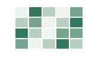 Heatmap</td>
<td>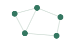 Network</td>
<td> Venn diagram</td>
</tr>
</tbody>
</table>

**Sets and genome positions**

<table>
<colgroup>
<col>
<col>
</colgroup>
<tbody>
<tr>
<td>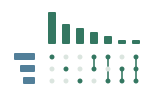 UpSet</td>
<td>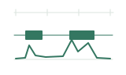 Genomic tracks</td>
</tr>
</tbody>
</table>

**Exact values**

<table>
<colgroup>
<col>
</colgroup>
<tbody>
<tr>
<td>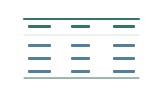 Table</td>
</tr>
</tbody>
</table>

## Choose and compare displays

<table>
<thead>
<tr>
<th>Reader’s task</th>
<th>Useful starting choice and qualification</th>
</tr>
</thead>
<tbody>
<tr>
<td>Compare amounts</td>
<td><strong>Dots or bars</strong> make positions or lengths easy to compare. Bars need a zero baseline. If differences among observations matter to the question, show them alongside the group means.</td>
</tr>
<tr>
<td>Inspect distributions</td>
<td>Use <strong>individual points</strong> to retain observations, a <strong>histogram</strong> for counts in intervals, or an <strong>ECDF</strong> for the fraction at or below each value. Boxplots summarize the median and middle half; density curves and violins smooth the shape, so check these views against the observations.</td>
</tr>
<tr>
<td>Compare matched observations</td>
<td><strong>Connected points</strong> show changes within matched samples that separate group summaries lose. <a href="#ref-display-weissgerber2015">[3]</a>.</td>
</tr>
<tr>
<td>Examine relationships</td>
<td>Use a <strong>scatterplot</strong> for two numerical variables. When overlapping points obscure how many observations occupy a region, try transparency or a <strong>hexbin</strong> display. A hexbin plot shows counts in bins, so individual observations can no longer be identified.</td>
</tr>
<tr>
<td>Follow time or dose</td>
<td><strong>Lines with observations</strong> emphasize progression. Position values according to their actual spacing; use aligned small multiples when several curves become difficult to follow.</td>
</tr>
<tr>
<td>Show composition</td>
<td><strong>Stacked bars</strong> show totals and their components; <strong>proportional stacked bars</strong> show each component’s fraction of the total. Middle segments begin at different positions, so separate dots or bars are often easier for comparing one component across samples.</td>
</tr>
<tr>
<td>Inspect matrices or intersections</td>
<td>A <strong>heatmap</strong> reveals patterns across a matrix, with ordering and scaling affecting what stands out. For numerous set intersections, use <strong>UpSet</strong>; simple Venn or Euler diagrams can suffice for two or three sets.</td>
</tr>
<tr>
<td>Retrieve exact values</td>
<td>Use a <strong>table</strong> with units and enough digits for the intended comparison, without implying more precision than the measurements support. A plot is usually quicker for seeing a trend or ranking; a small plot with value labels can also support exact lookup.</td>
</tr>
</tbody>
</table>

For fuller comparisons and examples, see Wong [[2]](#ref-display-wong2010), Wilke [[1, chapters 6–13 and 18]](#ref-display-wilke2019), Lex and Gehlenborg [[13]](#ref-display-lexgehlenborg2014), and Jambor [[10]](#ref-display-jambortables). The catalogs by Holtz and Healy [[11]](#ref-display-holtzhealy) and Ribecca [[12]](#ref-display-ribecca) show further display options.

## Explore alternatives

Inspect the observations before settling on a summary. Datasets with similar means and spreads can have quite different patterns; a boxplot, for example, can hide two clusters. If the data include several treatments or sample types, examine them separately as well as together. [[4]](#ref-display-shoresh2012); [[5]](#ref-display-matejka2017).

Change histogram bin widths and density smoothing to see whether an apparent feature persists. Coarse bins merge nearby features, while fine bins can make small fluctuations prominent. Check a violin’s shape against the observations. [[1]](#ref-display-wilke2019), chapters 7–9 and 18.

**Categories or a time course?**

The same fifteen readings appear in both displays below: one reporter culture per strain measured at 0, 1, 2, 4 and 8 hours. The grouped bars place the strains side by side at each time. In the aligned line panels, it is easier to follow Cedar’s early rise and decline and Hazel’s later rise. The horizontal spacing preserves elapsed time, including the longer interval between the final two measurements. Lines connect the recorded observations; they do not supply measurements between them. [[7]](#ref-display-streit2015); [[1]](#ref-display-wilke2019), chapters 13 and 21.

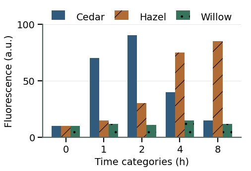

Grouped bars treat the five observation times as categories.

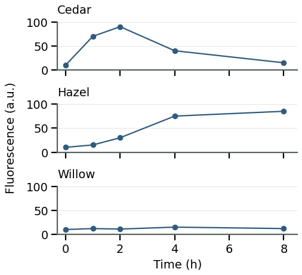

Aligned panels show each strain on the same time and fluorescence scales.

All plotted values are illustrative; the glossary icons are schematic.

**Ordering and scales**

Sort categories by value when readers need to identify the largest and smallest amounts. Keep an established sequence, such as developmental stages, when that order helps explain the result. Put the quantities readers need to compare next to one another, using a shared axis or aligned panels. [[1]](#ref-display-wilke2019), chapters 6 and 21; [[12]](#ref-display-ribecca).

Use the same axis scales across panels when comparing response sizes. If a smaller response becomes difficult to see, add a clearly labeled expanded view beside the full-range comparison. Giving each panel its own scale can make small and large fluctuations look alike. A linear axis uses equal distances for equal differences; a logarithmic axis uses equal distances for equal ratios, which helps compare positive values spanning orders of magnitude. [[1]](#ref-display-wilke2019), chapters 12 and 21; [[8]](#ref-display-mcinerny2015).

If color identifies treatment and shape identifies genotype, try separate panels for each genotype when the symbols become difficult to distinguish. Keep treatment colors and axes consistent across panels. For spatial structures, a three-dimensional view may be needed; compare it with projections when overlap obscures the relationship. [[1]](#ref-display-wilke2019), chapters 5 and 12; [[9]](#ref-display-gehlenborg2012).

Ask a colleague to answer the intended question from the display and caption; a different answer may expose an ambiguous grouping or scale. [[6]](#ref-display-rougier2014).

**Before settling on a display**

- Can readers find the groups being compared and see which observations are matched?

- Does the caption or legend identify what each mark and summary represents, including units and any denominator?

- Do the order and axis scales make the intended differences visible without exaggerating them?

- Does a view of the individual observations reveal anything hidden by aggregation, smoothing or overlap?

## References

1. [Wilke, C. O. (2019). **Fundamentals of Data Visualization.** O’Reilly Media.](https://clauswilke.com/dataviz/)

2. [Wong, B. (2010). **Design of data figures.** *Nature Methods*, 7, 665.](https://doi.org/10.1038/nmeth0910-665)

3. [Weissgerber, T. L., Milic, N. M., Winham, S. J., & Garovic, V. D. (2015). **Beyond Bar and Line Graphs: Time for a New Data Presentation Paradigm.** *PLOS Biology*, 13(4), e1002128.](https://doi.org/10.1371/journal.pbio.1002128)

4. [Shoresh, N., & Wong, B. (2012). **Data exploration.** *Nature Methods*, 9, 5.](https://doi.org/10.1038/nmeth.1829)

5. [Matejka, J., & Fitzmaurice, G. (2017). **Same Stats, Different Graphs: Generating Datasets with Varied Appearance and Identical Statistics through Simulated Annealing.** *Proceedings of CHI 2017*. ACM.](https://doi.org/10.1145/3025453.3025912)

6. [Rougier, N. P., Droettboom, M., & Bourne, P. E. (2014). **Ten Simple Rules for Better Figures.** *PLOS Computational Biology*, 10(9), e1003833.](https://doi.org/10.1371/journal.pcbi.1003833)

7. [Streit, M., & Gehlenborg, N. (2015). **Temporal data.** *Nature Methods*, 12, 97.](https://doi.org/10.1038/nmeth.3262)

8. [McInerny, G., & Krzywinski, M. (2015). **Unentangling complex plots.** *Nature Methods*, 12, 591.](https://doi.org/10.1038/nmeth.3451)

9. [Gehlenborg, N., & Wong, B. (2012). **Into the third dimension.** *Nature Methods*, 9, 851.](https://doi.org/10.1038/nmeth.2151)

10. [Jambor, H. (n.d.). **How to… Tables.** *HelenaJamborWrites*. [Web guide; publication date not stated; archived version accessed May 3, 2026].](https://helenajamborwrites.netlify.app/posts/tables/tabledesign)

11. [Holtz, Y., & Healy, C. (n.d.). **From Data to Viz.** [Website; accessed 17 September 2026].](https://www.data-to-viz.com/)

12. [Ribecca, S. (n.d.). **The Data Visualisation Catalogue.** [Website; accessed 17 September 2026].](https://datavizcatalogue.com/)

13. [Lex, A., & Gehlenborg, N. (2014). **Sets and intersections.** *Nature Methods*, 11, 779.](https://doi.org/10.1038/nmeth.3033)
