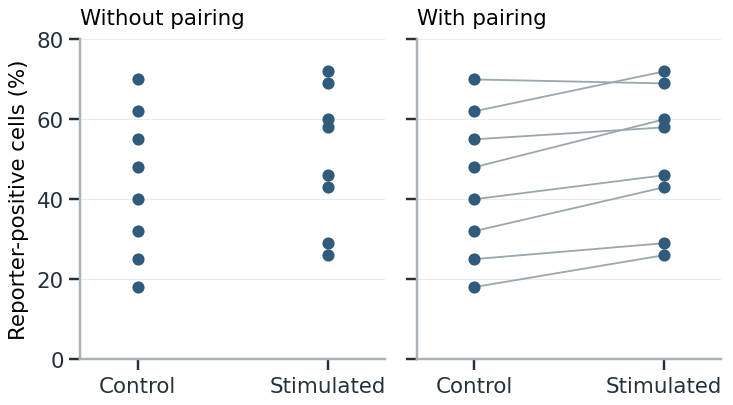

 

# Showing observations and uncertainty

A figure of repeated measurements can show both how much the observations vary and how precisely you have estimated their mean or a treatment effect. These are different quantities, so label the points, summaries and intervals that represent them. [[1]](#ref-uncertainty-wilke2019), chapter 16.

## Identify the observations

### Choose what the points show

Plot individual cells when the question concerns cell-to-cell variation. To compare responses across cultures or experimental repeats, show a summary for each culture or repeat. Both can appear in one figure, using smaller marks for cells and larger, distinct marks for sample summaries. [[2]](#ref-uncertainty-lord2020), pp. 1–2.

Keep the two levels distinct: the spread of cells within one treated culture shows variation within that culture, not how the treatment response varies across independent cultures. Likewise, repeated instrument readings show technical variation. [[2]](#ref-uncertainty-lord2020).

### Keep samples distinguishable

When several measurements come from each sample, show which belong together. Use separate panels or distinguish the samples within a plot. Add a summary for each sample if the comparison concerns differences between samples. Pooling all cells into one cloud hides whether a treatment response occurred in every experiment or was driven by one. [[2]](#ref-uncertainty-lord2020), Figure 1.

**Cells within cultures and culture summaries**

Each condition has three independently prepared cultures, with six cell measurements per culture. Small circles show cells; the larger diamond shows that culture’s mean. All plotted values are invented.

Cells form six labeled culture groups within two conditions. Small circles show cell-level reporter intensity and diamonds show the mean of each culture.

The horizontal displacement is **jitter**: it separates overlapping marks without changing their reporter-intensity values. When treatment is applied to cultures, measuring more cells describes each culture more thoroughly but does not add independently treated cultures. Cells can instead be independent units in a design that assigns treatment to cells individually and supports that independence. [[2]](#ref-uncertainty-lord2020), pp. 1–3.

## Show variation and matching

### Keep the observations visible

For repeated continuous measurements, a mean-only bar conceals the distribution, unusual values and overlap between groups. Show the individual measurements when they are readable, with a mean or median if it helps comparison. A bar remains useful when its height is the quantity being reported, such as a count or total amount. [[3]](#ref-uncertainty-weissgerber2019), pp. 1508–1510.

When points overlap, give each group the same small amount of horizontal jitter, keeping the measured values unchanged. Smaller or partly transparent points can also help. If the points remain too crowded, use a histogram, boxplot or violin plot. [[3]](#ref-uncertainty-weissgerber2019), Figure 3.

A boxplot summarizes the center and spread but can hide separate clusters. Use a histogram or violin when distribution shape matters. Check the bin width or smoothing: either can create or erase apparent peaks. For very small samples, show the points; there is too little information to infer a smooth distribution reliably. [[3]](#ref-uncertainty-weissgerber2019), pp. 1511–1514; [[1]](#ref-uncertainty-wilke2019), chapter 7.

A median describes the middle of the ordered values and is less affected by extremes; a mean includes their contribution to the average. Choose according to which quantity you want to report, then keep that choice consistent between the analysis and the figure. Showing the distribution helps readers see why the mean and median differ. [[1, chapters 6–7]](#ref-uncertainty-wilke2019).

**Identical boxplots, different distributions**

The two invented datasets below each contain 41 protein-abundance measurements. Their boxplots are identical, although one dataset is evenly spread and the other contains two clusters.

Adding observations reveals the different distributions. Both boxes span 25–75, with a median of 50 and whiskers at 0 and 100. Boxes show the middle 50%; whiskers extend to the most extreme observations within 1.5 interquartile ranges.

Use a boxplot to compare medians and quartiles; add observations or a distribution display when clusters and gaps matter. Retain points beyond the whiskers: the whisker rule does not establish that they are errors. [[4]](#ref-uncertainty-streit2014); [[6]](#ref-uncertainty-makin2019).

### Connect paired measurements

Connect measurements from the same sample before and after treatment, or control and treated measurements from the same experimental repeat. The lines show the direction and size of each change. Keep the original pair identities; connecting separately sorted values would create false pairs. [[2]](#ref-uncertainty-lord2020); [[3]](#ref-uncertainty-weissgerber2019), p. 1510.

**Example: showing a response across experiments**

In eight independent cell-culture experiments, each culture was split into control and stimulated conditions. The percentage of reporter-positive cells was measured in both. The two plots show the same illustrative measurements.

Connecting the pairs reveals an increase in seven experiments and a slight decrease in one.

The two groups overlap substantially. Without the lines, it is difficult to see that stimulation usually increased the response within an experiment.

To compare the changes themselves, plot the treated-minus-control difference for each pair, as in the next figure. If many lines overlap, separate subsets into small panels or show the distribution of changes. [[3]](#ref-uncertainty-weissgerber2019), p. 1510.

## Show estimates and uncertainty

### Choose the interval for the question

An **error bar** can show standard deviation, standard error or a confidence interval. Use standard deviation to summarize variation among observations; use a confidence interval to show the precision of an estimated mean or effect. Specify which quantity the bars show and identify the independent units in the caption. [[1]](#ref-uncertainty-wilke2019), chapter 16; [[2]](#ref-uncertainty-lord2020), p. 4.

<table>
<colgroup>
<col>
<col>
<col>
</colgroup>
<thead>
<tr>
<th>Quantity</th>
<th>What it describes</th>
<th>What to specify</th>
</tr>
</thead>
<tbody>
<tr>
<td>Standard deviation (SD)</td>
<td>Spread of observations around their mean.</td>
<td>Which observations: cells, sample means or paired differences.</td>
</tr>
<tr>
<td>Standard error (SE)</td>
<td>How much an estimate would vary across repeated samples.</td>
<td>The estimate and the independent units used in the calculation.</td>
</tr>
<tr>
<td>Confidence interval (CI)</td>
<td>Precision of an estimate, using a method with a stated confidence level.</td>
<td>The estimate, confidence level and calculation method.</td>
</tr>
<tr>
<td>Credible interval</td>
<td>A range containing a stated probability for a parameter under a Bayesian model.</td>
<td>The probability level, model and prior.</td>
</tr>
</tbody>
</table>

[[1]](#ref-uncertainty-wilke2019), pp. 186–196.

For independent observations, the standard error of the mean is estimated as SD divided by the square root of n. More independent samples usually give a more precise mean, even when the observations remain just as variable. Counting dependent measurements as independent samples makes the SE misleadingly small. [[1]](#ref-uncertainty-wilke2019); [[2]](#ref-uncertainty-lord2020).

In the culture example, cells from the same culture share its treatment and conditions. To estimate a treatment effect, you can analyze culture summaries or use an analysis that accounts for this dependence among cells. Treating all the cells as independently treated samples would exaggerate the replication and make the treatment estimate appear too precise. [[2]](#ref-uncertainty-lord2020), pp. 2–4; [[6]](#ref-uncertainty-makin2019).

**Example: variation and precision**

Subtract the control percentage from the stimulated percentage in each of the eight experiments above. The resulting changes range from −1 to 12 percentage points, with a mean of 6.6.

The same eight changes give different intervals: SD describes their spread; SE and the confidence interval describe precision of the mean.

The SD is 4.5 percentage points; the SE is 1.6. The 95% CI for the mean change is 2.9–10.4 percentage points. It was calculated as the mean ± 2.365 SE, using a Student-t interval with seven degrees of freedom. This calculation assumes independent experiments and approximately normally distributed experimental differences. Use the SD to describe how much the changes vary, and the CI to report how precisely their mean is estimated.

The values in the paired and interval figures are invented teaching observations.

The “95%” describes the confidence-interval method: across repeated samples, 95% of the intervals would contain the population mean if the assumptions hold. It does not mean that 95% of individual measurements lie inside the interval. A Bayesian credible interval instead gives a probability for the parameter under its model and prior. [[1]](#ref-uncertainty-wilke2019), pp. 194–196.

### Plot the effect being compared

Show the estimated treatment effect and its interval alongside the observations. For a difference, mark zero; for a ratio, mark one. Label the direction and units, such as “stimulated − control, percentage points.” [[5]](#ref-uncertainty-ho2019); [[1]](#ref-uncertainty-wilke2019), p. 191.

Calculate the interval for the comparison itself. For paired data, use an analysis that preserves pairing. For an adjusted estimate, use the model’s effect estimate and interval, labeled separately from the raw measurements. Overlap between two groups’ error bars is not a reliable test of their difference. [[1]](#ref-uncertainty-wilke2019), p. 191; [[2]](#ref-uncertainty-lord2020).

Compare the interval with the size of effect your question concerns. If it includes both no change and an increase of the size predicted by the proposed biological explanation, the estimate does not distinguish those possibilities. Reporting only “not significant” would hide that uncertainty. A small P value, in turn, does not show that an effect is large enough to matter biologically. [[5]](#ref-uncertainty-ho2019); [[6]](#ref-uncertainty-makin2019).

An interval describes uncertainty under the analysis assumptions. If every treated sample was measured in one batch and every control in another, even a narrow interval cannot tell you whether treatment or batch caused the difference. Check the design and controls before interpreting the effect as causal. [[6]](#ref-uncertainty-makin2019).

## Align the display with the analysis

### Keep transformations visible

Place observations, summaries and intervals on the same labeled scale. A logarithmic axis changes their positions, not how the mean was calculated. If you display a log-scale difference as a ratio, back-transform both the estimate and its interval. [[1]](#ref-uncertainty-wilke2019), chapters 3 and 16.

Normalizing each treated value to its paired control makes every control equal to one and hides the original control variation. Show the unnormalized measurements when that variation matters, and explain how it was included in the analysis. Connecting paired measurements may make normalization unnecessary, as in the [paired-measurement example](#uncertainty-paired-example). [[2]](#ref-uncertainty-lord2020), p. 4.

### Show which observations enter the comparison

Use a distinct symbol for displayed observations excluded from the analysis, and explain it in the caption. If an extreme value compresses the rest of the plot, add a zoomed view while retaining the full-range view. [[3]](#ref-uncertainty-weissgerber2019), p. 1515; [[6]](#ref-uncertainty-makin2019).

Arrange groups and panels around the comparisons being analyzed. If the question is whether a treatment works differently in two groups, show the difference between their effects and its uncertainty. Separate significance labels for the two groups do not show whether their effects differ. [[3]](#ref-uncertainty-weissgerber2019), pp. 1514–1515; [[6]](#ref-uncertainty-makin2019).

## Check the figure and caption

Use the caption to explain how to read the figure. Define the points, lines, summaries and intervals. For a boxplot, specify the median, quartiles and whisker rule; whiskers may show the range or use a rule based on the interquartile range. [[4]](#ref-uncertainty-streit2014).

Give exact sample sizes for each group and level—for example, cultures and cells per culture—and the number of complete pairs for a paired comparison. “Biological replicates” or “n = 3–8” alone is insufficient. [[2]](#ref-uncertainty-lord2020), pp. 1–2; [[3]](#ref-uncertainty-weissgerber2019), p. 1515.

State whether summaries use raw, transformed or normalized values. Account for missing and excluded observations, with reasons. Identify any adjustment for multiple comparisons and which comparisons it covers. Name the analysis and refer to Methods for fuller details. See [Methods, results and figure legends](../04-writing-a-paper/03-methods-results-and-figure-legends.md#reporting-chapter) for legend structure. [[3]](#ref-uncertainty-weissgerber2019), pp. 1514–1515.

**Caption for the interval comparison**

Changes in reporter-positive cells after stimulation in eight independent experiments. Circles show stimulated-minus-control differences, one per experiment. Diamonds show the mean; bars indicate ±1 SD, ±1 SE or the two-sided 95% Student-t confidence interval (7 degrees of freedom), as labeled. Each experiment included both conditions; no observations were excluded.

**Before finalizing the figure**

- Define each mark and give sample sizes at the relevant levels.

- Show individual measurements, grouping and pairing where needed.

- Name the summary and interval, including its level and calculation method.

- Check units, comparison direction, transformations and exclusions against the analysis.

- Show the effect’s magnitude and uncertainty, not only its significance.

## References

1. [Wilke, C. O. (2019). **Fundamentals of Data Visualization.** O’Reilly Media.](https://clauswilke.com/dataviz/)

2. [Lord, S. J., Velle, K. B., Mullins, R. D., & Fritz-Laylin, L. K. (2020). **SuperPlots: Communicating reproducibility and variability in cell biology.** *Journal of Cell Biology*, 219(6), e202001064.](https://doi.org/10.1083/jcb.202001064)

3. [Weissgerber, T. L., Winham, S. J., Heinzen, E. P., Milin-Lazovic, J. S., Garcia-Valencia, O., Bukumiric, Z., Savic, M. D., Garovic, V. D., & Milic, N. M. (2019). **Reveal, Don’t Conceal: Transforming Data Visualization to Improve Transparency.** *Circulation*, 140(18), 1506–1518.](https://doi.org/10.1161/CIRCULATIONAHA.118.037777)

4. [Streit, M., & Gehlenborg, N. (2014). **Bar charts and box plots.** *Nature Methods*, 11, 117.](https://doi.org/10.1038/nmeth.2807)

5. [Ho, J., Tumkaya, T., Aryal, S., Choi, H., & Claridge-Chang, A. (2019). **Moving beyond P values: data analysis with estimation graphics.** *Nature Methods*, 16, 565–566.](https://doi.org/10.1038/s41592-019-0470-3)

6. [Makin, T. R., & Orban de Xivry, J.-J. (2019). **Science Forum: Ten common statistical mistakes to watch out for when writing or reviewing a manuscript.** *eLife*, 8, e48175.](https://elifesciences.org/articles/48175)
