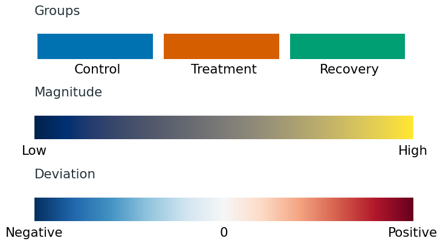

 

# Color, symbols and accessibility

Color can identify groups, show how a quantity varies or draw attention to a selected observation. Choose distinct colors for groups, an ordered gradient for values, or an accent color for a highlight. [[1]](#ref-color-wilke2019), chapter 4.

## Decide what color should show

For a plot of one series, a single dark color is usually enough. When comparing treatments, assign a distinct color to each treatment and keep that assignment across the paper. Avoid giving every bar or point a different color when its label or position already identifies it. [[9]](#ref-color-rougier2014), rule 6; [[8]](#ref-color-muth2018).

To highlight one group, give it an accent color and label it. Keep the other observations visible in a subdued color. If readers should compare all groups equally, avoid making one much brighter or more saturated than the others: it can attract attention for reasons unrelated to the data. [[2]](#ref-color-wongcolor2010); [[1]](#ref-color-wilke2019), chapter 4.

Color is useful for finding patterns in a large matrix, but less reliable for judging small numerical differences. The same colored square can look different against light and dark surroundings. If readers need to compare a few values precisely, put them on a common axis or print the values rather than asking readers to estimate them from a color key. [[3]](#ref-color-wongavoid2011); [[5]](#ref-color-gehlenborgcolor2012).

## Match the scale to the data

### Groups, magnitudes and deviations

Use a **categorical palette** for groups without a numerical order, such as cell types or treatments. The colors should be distinguishable without suggesting that one group is greater than another. Shades from pale to dark imply an order and are better suited to quantities such as dose. For unordered groups, start with an established categorical palette such as Okabe–Ito, then check the selected colors in the actual plot. [[4]](#ref-color-wongblind2011); [[1]](#ref-color-wilke2019), chapters 4 and 19.

Use a **sequential scale** for values that run from low to high. Lightness should change steadily, so that equal numerical steps produce roughly comparable visible changes. This can be a single-hue gradient or a multihue palette such as cividis or viridis. Consider which values should stand out against the background: dark marks are prominent on white, while light marks stand out on a dark background. [[5]](#ref-color-gehlenborgcolor2012); [[7]](#ref-color-crameri2024), pp. 3–6.

Use a **diverging scale** to distinguish values above and below a reference, such as no change or a specified target. Give the two sides different hues and make the reference neutral. No change is zero for a log fold change and one for a ratio. Set that reference explicitly; the middle of the observed range may represent a different value. [[5]](#ref-color-gehlenborgcolor2012); [[7]](#ref-color-crameri2024), pp. 3–6.

**Three common color encodings**

Categories use separate colors; magnitudes follow an ordered gradient; deviations use two directions from a reference. Shown here: three Okabe–Ito colors, cividis and RdBu.

Avoid rainbow scales for ordinary quantitative data. Their uneven changes in hue and lightness can create apparent boundaries where the values change smoothly, while making other differences difficult to see. Selecting a well-designed scale is easier than constructing one by eye. [[2]](#ref-color-wongcolor2010); [[1]](#ref-color-wilke2019), chapter 19.

Two less common choices are useful when the data require them. A **cyclic scale** has matching ends, so angles near 0° and 360°, or phases immediately before and after a cycle boundary, look similar. A **discrete ordered scale** divides values into labeled ranges. Use it when those ranges matter; use a continuous gradient when variation within them matters. Show the boundaries of discrete ranges in the key. [[7]](#ref-color-crameri2024), pp. 2–3.

### Set the reference and limits

Use the same color limits for panels whose values you want readers to compare. Otherwise, a color indicating a small response in one panel may indicate a much larger response in another. Within a single panel, you can show the full possible range or a narrower range that makes small differences easier to see. Show the chosen limits in the colorbar. [[5]](#ref-color-gehlenborgcolor2012), Figure 1.

**Full possible range or local range?**

The same invented percentages appear twice. On the full 0–100% scale, the 42–58% values have little color contrast. On the stated 40–60% local scale, their differences are easier to see. The narrow scale uses its strongest colors for values still near 50%, so readers need the colorbar to interpret their size. Use shared limits if these values must be compared with other panels.

Two identical heatmaps of reporter-positive percentages. The upper colorbar spans zero to one hundred percent and the lower spans forty to sixty percent; all cells retain their printed values.

For a diverging scale, equal departures from the reference should receive comparable color strength. With values from −1 to +3, stretching both ends to equally strong colors would give −1 as much emphasis as +3. A balanced −3 to +3 scale avoids that distortion, even though part of its negative range is unused. [[7]](#ref-color-crameri2024), Figure 4.

**Center the scale on the biological reference**

These invented log₂ fold changes range from −1 to +3. Zero means no change. Both panels show the same values.

Automatic minimum-to-maximum scaling puts the pale color at +1. Centering the scale on zero correctly distinguishes decreases from increases and gives equal-sized changes comparable emphasis.

Label what the colorbar measures, including units and transformations: for example, “log₂ fold change” or “row-standardized expression.” If values beyond a limit all receive the same end color, indicate that saturation in the key. Give missing values a separate labeled appearance so they cannot be mistaken for zero or the lowest measurement. [[5]](#ref-color-gehlenborgcolor2012); [[1]](#ref-color-wilke2019), chapter 4.

## Use symbols and labels alongside color

For a few overlaid series, combine color with distinct markers or simple line styles. Label lines near their ends when there is room; otherwise use a compact key with the actual marker, fill and line style. Arrange key entries in the same order as the curves where a clear visual order exists. Complex dash patterns become difficult to follow on tightly turning curves; direct labels or separate panels work better there. Refer to the group by name in the caption, rather than only as “the red line.” [[6]](#ref-color-symbols2013); [[7]](#ref-color-crameri2024), Figure 5; [[1]](#ref-color-wilke2019), chapter 20.

Choose shapes that remain distinct at the final size. Circles and squares are usually easier to distinguish than several similar polygons. Adjust their sizes so they appear equally prominent; equal numerical marker sizes do not necessarily give equal visual weight. Open circles can reveal overlapping boundaries, whereas large filled symbols can merge into a solid patch. If overlap is severe, changing symbols alone will not solve it: separate groups into panels or use a distribution display. [[6]](#ref-color-symbols2013), Figures 1–3.

Color and shape can both identify treatment, so readers have two ways to follow the same groups. If color instead identifies treatment and shape identifies genotype, each combination represents a different group. When this becomes hard to follow, use separate panels for each genotype and keep the treatment colors consistent. Show fewer groups together when readers cannot reliably match them to the key. [[6]](#ref-color-symbols2013); [[1]](#ref-color-wilke2019), chapter 19.

**Separate panels for each genotype**

Separate WT and KO panels make the treatment response easier to follow within each genotype. The combined view is useful for comparing genotypes directly, but readers must distinguish both colors and symbols. Both arrangements show the same invented values.

A line plot with four series uses color for treatment and marker and line style for genotype. Below it, two panels labelled WT and KO show the same treatment trajectories with consistent blue and vermilion colors.

**Keep series identifiable without hue**

The same invented reporter trajectories in color and grayscale. Direct labels, circles versus squares, and solid versus dashed lines preserve the series identities.

## Make marks readable on their background

A palette that works in large swatches may fail on thin lines or small points. Inspect the plot at its intended reading size. Darken pale marks, increase their size or weight, or use a more distinct shape if they disappear. Large filled areas often need less saturation than small marks; intense fills can overwhelm nearby labels and grid lines. [[2]](#ref-color-wongcolor2010); [[1]](#ref-color-wilke2019), pp. 236–242.

Check colors against the background and against neighboring marks. Yellow may be clear on a dark background but nearly invisible on white. Transparency also changes the displayed color through blending, so inspect overlapping regions as well as isolated points. Keep essential labels dark enough to read; a label need not inherit the color of the series it names. [[8]](#ref-color-muth2018); [[2]](#ref-color-wongcolor2010); [[1]](#ref-color-wilke2019), chapters 18 and 20.

For choosing colors for fluorescence channels and showing merged images, see [Biological images](04-biological-images.md#bioimage-chapter). [[4]](#ref-color-wongblind2011), Figure 3.

## Check accessibility and consistency

Inspect the finished figure under simulations of common red–green and blue–yellow color-vision deficiencies. Test whether the groups remain distinguishable, whether a quantitative gradient still has a clear order, and whether labels and small marks remain visible. If a distinction disappears, change the palette or supply it through labels, shapes or separate panels. Check the exported figure, not just the palette preview. [[4]](#ref-color-wongblind2011); [[1]](#ref-color-wilke2019), Figure 19-11.

Grayscale reveals weak contrast and whether identification depends entirely on hue. A symmetric diverging scale will often give negative and positive values similar gray levels: it preserves distance from the center but loses direction. If that direction must survive monochrome reproduction, add signed values, explicit labels or separate views. [[7]](#ref-color-crameri2024), pp. 3–8; [[1]](#ref-color-wilke2019), chapter 19.

Check the figure alongside the rest of the paper. Do recurring groups keep their colors and symbols? Do comparable panels use the same scale and reference? Check that keys, direct labels and captions agree, including the labels for missing values and highlighted observations. [[8]](#ref-color-muth2018).

**Before finalizing the colors and symbols**

- Does each encoding identify a group, show a quantity or mark a deliberate highlight?

- Do the palette type, reference and limits match the quantity being shown?

- Can readers distinguish the important groups without relying on hue alone?

- Are marks and labels readable at final size, including in grayscale and color-vision simulations?

- Do recurring colors and symbols mean the same thing across panels?

The teaching graphics use invented values or schematic encodings.

## References

1. [Wilke, C. O. (2019). **Fundamentals of Data Visualization.** O’Reilly Media.](https://clauswilke.com/dataviz/)

2. [Wong, B. (2010). **Color coding.** *Nature Methods*, 7, 573.](https://doi.org/10.1038/nmeth0810-573)

3. [Wong, B. (2011a). **Avoiding color.** *Nature Methods*, 8, 525.](https://doi.org/10.1038/nmeth.1642)

4. [Wong, B. (2011b). **Color blindness.** *Nature Methods*, 8, 441.](https://doi.org/10.1038/nmeth.1618)

5. [Gehlenborg, N., & Wong, B. (2012). **Mapping quantitative data to color.** *Nature Methods*, 9, 769.](https://doi.org/10.1038/nmeth.2134)

6. [Krzywinski, M., & Wong, B. (2013). **Plotting symbols.** *Nature Methods*, 10, 451.](https://doi.org/10.1038/nmeth.2490)

7. [Crameri, F., Shephard, G. E., & Heron, P. J. (2024). **Choosing Suitable Color Palettes for Accessible and Accurate Science Figures.** *Current Protocols*, 4, e1126.](https://doi.org/10.1002/cpz1.1126)

8. [Muth, L. C. (2018, May 29). **What to consider when choosing colors for data visualization.** Datawrapper Blog. Accessed September 18, 2026.](https://www.datawrapper.de/blog/colors)

9. [Rougier, N. P., Droettboom, M., & Bourne, P. E. (2014). **Ten Simple Rules for Better Figures.** *PLOS Computational Biology*, 10(9), e1003833.](https://doi.org/10.1371/journal.pcbi.1003833)
