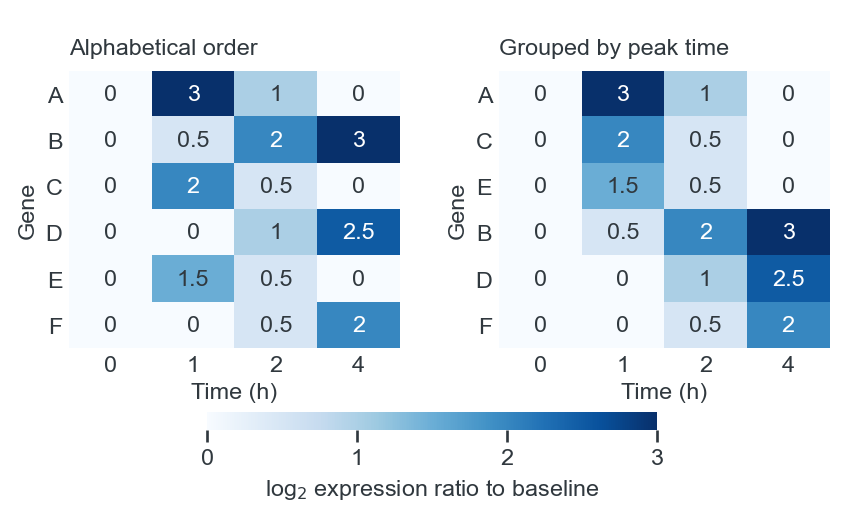
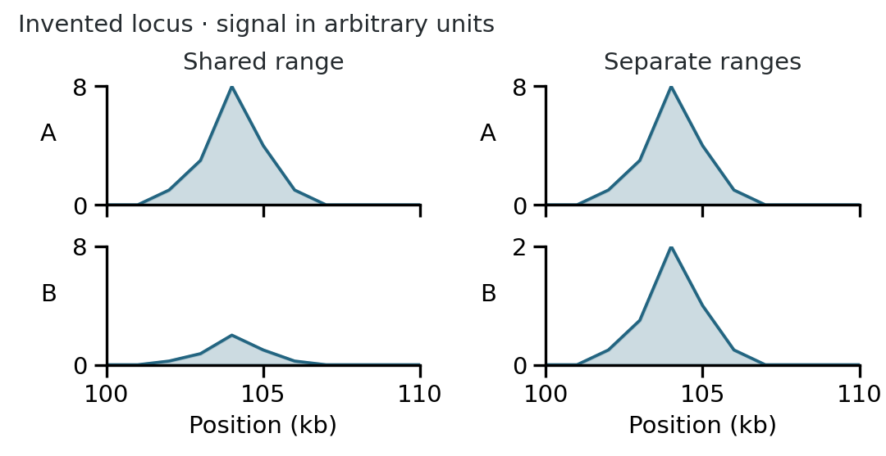
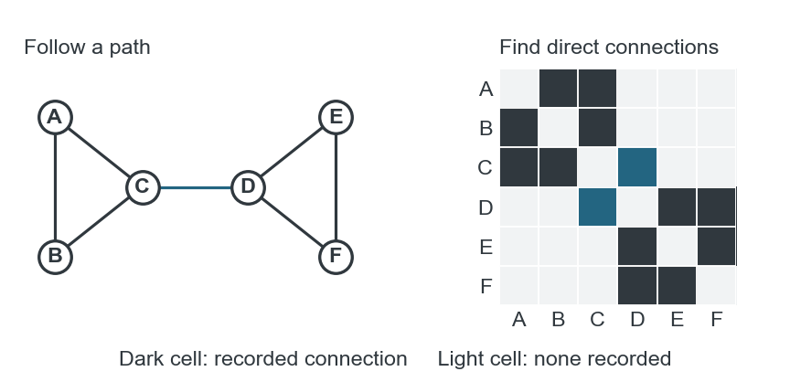
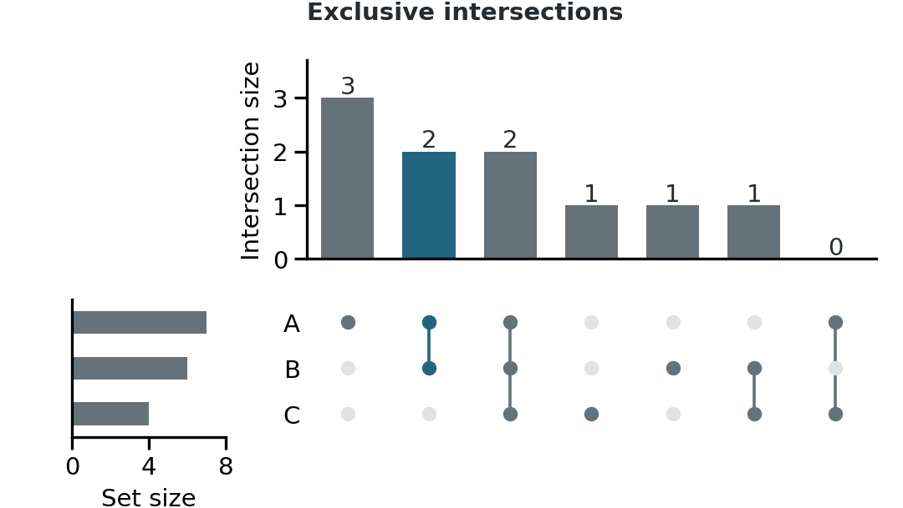

 

# Specialized displays and explanatory diagrams

Explain how to read the display. In a heatmap, label the quantity shown by color and explain how the rows and columns are ordered. In a pathway diagram, identify the molecules or processes and explain what the arrows mean.

## Data displays

### Heatmaps

Use a heatmap to compare patterns across many genes, samples or conditions. Decide whether color should show abundance, a ratio to a reference or a standardized value. With row standardization, each gene is centered and scaled separately. The colors then show which samples have high or low values for that gene; they cannot tell readers which gene is more abundant. Name the quantity on the color key. [[1]](#ref-specialist-heatmaps2012); [[2]](#ref-specialist-ligraphs), sections 3–7.

Arrange rows and columns to expose the comparison. Keep time points in chronological order and doses in concentration order. Group samples by known conditions when those conditions are the focus; cluster them when the question is which samples have similar profiles. Apply the same order to accompanying annotations and related panels. A sample-group strip beside a heatmap can show whether an apparent cluster follows treatment, batch or another recorded characteristic. [[1]](#ref-specialist-heatmaps2012); [[2]](#ref-specialist-ligraphs), section 5 and heatmap tutorial.

In hierarchical clustering, branches can rotate without changing their relationships, and neighboring rows on the page need not be close relatives in the tree. Retain the dendrogram when those relationships matter. State the transformation, distance measure and clustering method in the caption or Methods. [[1]](#ref-specialist-heatmaps2012).

**Ordering rows while preserving time**

The same six invented gene profiles in alphabetical order and grouped by the time of their maximum. Both heatmaps retain columns at 0, 1, 2 and 4 hours and an identical zero-to-three color scale.

Equal column widths do not represent equal elapsed time here. Use a line plot with proportional time spacing when readers need to compare rates.

Inspect the value distribution before fixing the color limits. A few extreme values can leave most cells nearly the same shade. A transformation may make differences among the less extreme values easier to see. Another option is to assign values above a chosen limit the same endpoint color; label the limit and make the extreme values available so readers can identify them. Use the [color-scale guidance](03-color-symbols-and-accessibility.md#color-scales) to choose a sequential or diverging palette. For close comparisons between a few profiles, aligned line plots are easier to read than small color differences. [[2]](#ref-specialist-ligraphs), section 6; [[1]](#ref-specialist-heatmaps2012), Figure 2.

### Genomic tracks and rearrangements

Use aligned tracks when readers need to compare signals at the same locus. Show the genomic interval and coordinate scale, identify the reference assembly, and align gene models and measurements to the same positions. Tracks being compared for signal magnitude need compatible units and the same vertical scale. A track rescaled to its own maximum can show its shape, but its height cannot then be compared directly with a neighboring track. [[3]](#ref-specialist-genome2012); [[4]](#ref-specialist-browser2012).

**Shared and separate track ranges**

Track B has one quarter of A’s signal at every position. Shared ranges show that difference; separate ranges give the peaks the same apparent height. Both columns contain the same invented values and genomic positions.

A chromosome-wide view can hide a narrow peak because many bases contribute to each displayed bin. Use a locus view to show local detail, adding an overview if readers also need to locate it on the chromosome. Mark any breaks where intervening sequence has been removed. To compare regions around a feature such as a transcription start site, align them at that feature and orient them consistently. The horizontal coordinate then describes distance from the feature rather than absolute position in the genome. [[3]](#ref-specialist-genome2012), Figure 2.

When there are too many tracks to read, a heatmap can fit them into less space while retaining a row for each sample. Exact signal magnitudes will be harder to judge from color. Averaging tracks reduces clutter too, but hides differences between samples; an inferred state also replaces measured values with a summary. Keep the individual tracks available if those differences affect the interpretation. For a few profiles, an overlay may work, provided filled areas and blended colors do not obscure one another. [[4]](#ref-specialist-browser2012), Figure 2.

For structural variation, decide whether readers need to locate breakpoints or understand the rearranged sequence. Arcs connect the joined positions; arranging the genome in a circle brings distant loci closer, although the arcs can become crowded. To show an inversion or a new sequence order, use sequence blocks with their orientation marked, or a dot plot comparing reference and variant coordinates. In the dot plot, corresponding segments form lines whose direction shows their orientation. [[5]](#ref-specialist-variation2012), Figure 1.

### Networks

Use a node-link diagram when readers need to follow a path or identify a node’s neighbors. Define what a connection represents: physical interaction, coexpression, regulation and sequence adjacency are different relationships. Add arrowheads only when direction is part of the data. Try alternative layouts, then retain one that makes the relevant paths and groups easy to follow. Unless positions have a defined biological meaning, proximity on the page is a layout choice. [[6]](#ref-specialist-networks2012); [[2]](#ref-specialist-ligraphs), section 8.

For dense networks, an adjacency matrix avoids overlapping edges. The same nodes appear along both axes, and a marked cell records a connection between its row and column nodes. Placing related nodes together can reveal groups with many connections within them and fewer between them. To follow a chain through several nodes, use a node-link diagram instead. If you show only part of a network, explain how you selected it. [[6]](#ref-specialist-networks2012).

**Two views of the same connections**

An undirected six-node network beside its adjacency matrix. The C–D bridge is blue in both views; other recorded edges are dark gray.

Follow the path from A through C and D to F in the node-link view; use row C of the matrix to find its direct neighbors. A light cell means no connection is recorded in this invented dataset.

When adding expression or activity to a network, keep node positions fixed across conditions and use color to show the measured quantity. Put each condition in a separate panel so readers can compare states side by side. With animation, they must remember earlier frames. [[7]](#ref-specialist-integrating2012), Figure 2.

### Set intersections

For a few simple overlaps, a labeled Euler or Venn diagram can be sufficient. Use UpSet when there are many sets or when readers need to compare intersection sizes. Its bars provide a common baseline for counts, and the membership matrix below identifies the set combination for each bar. Include set totals when the size of an intersection needs that context. Order intersections by size or by the combinations relevant to the question. [[8]](#ref-specialist-lexgehlenborg2014).

Distinguish exclusive combinations from inclusive overlap. “A and B only” excludes members of C; “A and B” may include them. In an exclusive UpSet display, active dots identify the included sets and inactive dots exclude the others. A heatmap of pairwise overlaps can show overlap counts, but it does not identify which elements make up a three-way intersection. Define the counting rule, and identify omitted or filtered intersections. [[8]](#ref-specialist-lexgehlenborg2014), Figure 1.

**Reading an exclusive intersection**

Each upper bar counts the combination marked directly below it. The blue bar counts two members in A and B but not C; the next bar counts two members in all three sets. Thus the inclusive overlap of A and B is four. Side bars show each set’s total membership.

### Multivariable displays

For a multifactor experiment, assign the main comparisons to rows and columns before adding color, size or shape. For example, a grid can put cell types in rows and treatments in columns, with the same signaling diagram in each cell. Measured responses then appear at their corresponding pathway nodes. This is useful when the pathway explains the results; a conventional plot is simpler when readers only need to compare magnitudes. [[9]](#ref-specialist-multidimensional2013), Figures 2–3.

Use a scatterplot matrix to inspect pairwise relationships among variables. Use parallel coordinates when the profile of an individual sample across several variables matters: each sample becomes a line joining its values on parallel axes. Axis order and scaling affect the patterns, so keep comparable measurements on comparable scales and label any separate scaling. Too many overlapping profiles or repeated categorical values can make individual lines impossible to follow. [[10]](#ref-specialist-plane2012).

### Cycles and trajectories

To compare repeated cycles, align corresponding time intervals, then examine when the response begins, when it peaks or how long it lasts. Keep elapsed-time units when duration matters. Rescaling cycles to a common phase can clarify their shape, but hides differences in cycle length. Aligned linear plots make precise comparisons easier than radial plots. When a plot’s axes already show other quantities, connect successive observations and indicate their order to show a trajectory through time. Use separate panels for selected times when readers need to compare positions at those times. [[11]](#ref-specialist-streit2015).

When responses span very different ranges, small multiples can show each pattern more clearly. Use shared scales for magnitude comparisons. If individual scales are necessary, make the ranges conspicuous and consider retaining a common-scale overview beside the enlarged detail. [[12]](#ref-specialist-mcinerny2015).

## Explanatory diagrams

### Show the experimental design

Sketch the starting material, the main operations and the resulting measurements. Keep the same objects recognizable from one step to the next, and label the operation that changes them. If a sample splits into control and treatment branches, align corresponding steps so the difference between branches is easy to locate. Show collection points on a proportional timeline when their spacing matters; otherwise a sequence of labeled steps is sufficient. [[13]](#ref-specialist-wong2011).

Include biological structures when they help explain the procedure, such as a compartment boundary that locates a reaction. Use a text label if readers might not recognize a pictogram. A schematic heatmap can stand for an analysis step, but label it as a schematic so it cannot be mistaken for a result. [[14]](#ref-specialist-natureconcept); [[13]](#ref-specialist-wong2011).

**Experimental sequence and biological explanation**

A hypothetical split-culture experiment and a separate signaling diagram. Experimental arrows connect culture, intervention, ligand pulse and reporter measurement. Mechanism arrows connect ligand, receptor, kinase and a proposed nuclear response.

The experimental arrows mark a sequence of operations; the mechanism arrows represent biological effects. The dashed edge identifies the untested connection.

### Mechanisms and pathways

Define each type of connection in the figure or legend. A plain line can show an association, an arrow a directed process and a blunt end inhibition. To connect a label to an object, use a line without an arrowhead and keep it visually distinct from the biological connections. Otherwise, readers may mistake it for another reaction. [[15]](#ref-specialist-arrows2011).

Arrange the main pathway in a consistent reading direction, with branches and feedback loops routed around it. Place nodes on a simple grid and use consistent connection points to reduce crossings. Group components by compartment or function where that grouping helps explain the process. Keep node shapes consistent rather than stretching each one to fit its label. [[16]](#ref-specialist-pathways2016).

Preserve spatial relationships when they are part of the explanation: a membrane crossing, a cortical layer or the location of a synaptic contact may be essential. When location is irrelevant, move nodes to make the connections clearer. Avoid drawing precise anatomical routes when only connectivity is known. Mark proposed or indirect steps explicitly, using a defined dashed line or a short label. [[17]](#ref-specialist-circuits2016).

### Overviews and graphical abstracts

Sketch a sequence for a process, parallel views for a comparison, or a focused scene for a spatial mechanism. Reserve circular layouts for cycles. Compare rough alternatives before polishing the artwork. [[18]](#ref-specialist-jamborabstracts2024), rules 1, 4–6.

A graphical abstract about a finding should show the finding, not just the workflow used to obtain it. A methods contribution may instead need the distinctive operation and the capability it enables. Include a result plot only when readers can understand it at the displayed size. A procedural overview can use a simplified symbol for a measurement step; a quantitative result still needs enough labeling to identify its quantities and groups. [[13]](#ref-specialist-wong2011); [[18]](#ref-specialist-jamborabstracts2024), rules 2–3 and 7.

Emphasize the main action and simplify the surroundings. Keep illustrations consistent in detail, stroke and color meaning. Label unfamiliar objects directly, replace decorative icons with text, and remove repeated steps that add no information. If using an icon library, check the selected asset’s attribution and publication conditions. [[14]](#ref-specialist-natureconcept); [[18]](#ref-specialist-jamborabstracts2024), rules 2 and 7–9.

Show a rough version to a colleague before refining it. Ask what they notice first, where they start reading and what each arrow means. Then inspect the final version at its actual display size: a diagram that works across a full page may need fewer elements when used as a thumbnail. [[18]](#ref-specialist-jamborabstracts2024), rules 4 and 10.

**Final display check**

- Can readers make the intended comparison or follow the main path?

- Are values, ordering, scale changes and omitted data identifiable?

- Do positions, connections and symbols mean what the figure suggests?

- Are proposed relationships distinguishable from established ones?

- Are the essential labels readable at the intended size?

Original illustrations with invented data.

## References

1. [Gehlenborg, N., & Wong, B. (2012a). **Heat maps.** *Nature Methods*, 9, 213.](https://doi.org/10.1038/nmeth.1902)

2. [Li, C. (n.d.). **Friends Don’t Let Friends Make Bad Graphs.** GitHub. Accessed September 18, 2026.](https://github.com/cxli233/FriendsDontLetFriends)

3. [Nielsen, C., & Wong, B. (2012a). **Representing the genome.** *Nature Methods*, 9, 423.](https://doi.org/10.1038/nmeth.1992)

4. [Nielsen, C., & Wong, B. (2012b). **Managing deep data in genome browsers.** *Nature Methods*, 9, 521.](https://doi.org/10.1038/nmeth.2049)

5. [Nielsen, C., & Wong, B. (2012c). **Representing genomic structural variation.** *Nature Methods*, 9, 631.](https://doi.org/10.1038/nmeth.2018)

6. [Gehlenborg, N., & Wong, B. (2012c). **Networks.** *Nature Methods*, 9, 115.](https://doi.org/10.1038/nmeth.1862)

7. [Gehlenborg, N., & Wong, B. (2012b). **Integrating data.** *Nature Methods*, 9, 315.](https://doi.org/10.1038/nmeth.1944)

8. [Lex, A., & Gehlenborg, N. (2014). **Sets and intersections.** *Nature Methods*, 11, 779.](https://doi.org/10.1038/nmeth.3033)

9. [Krzywinski, M., & Savig, E. (2013). **Multidimensional data.** *Nature Methods*, 10, 595.](https://doi.org/10.1038/nmeth.2531)

10. [Gehlenborg, N., & Wong, B. (2012d). **Power of the plane.** *Nature Methods*, 9, 935.](https://doi.org/10.1038/nmeth.2186)

11. [Streit, M., & Gehlenborg, N. (2015). **Temporal data.** *Nature Methods*, 12, 97.](https://doi.org/10.1038/nmeth.3262)

12. [McInerny, G., & Krzywinski, M. (2015). **Unentangling complex plots.** *Nature Methods*, 12, 591.](https://doi.org/10.1038/nmeth.3451)

13. [Wong, B. (2011b). **Points of view: The overview figure.** *Nature Methods*, 8, 365.](https://www.nature.com/articles/nmeth0511-365)

14. [Nature (n.d.). **Scientific illustration for commissioned content: Our guiding principles for conceptual figures.** Nature. Accessed September 18, 2026.](https://www.nature.com/documents/Nature_scientific_illustration_author_guide.pdf)

15. [Wong, B. (2011a). **Arrows.** *Nature Methods*, 8, 701.](https://doi.org/10.1038/nmeth.1676)

16. [Hunnicutt, B. J., & Krzywinski, M. (2016b). **Pathways.** *Nature Methods*, 13, 5.](https://doi.org/10.1038/nmeth.3699)

17. [Hunnicutt, B. J., & Krzywinski, M. (2016a). **Neural circuit diagrams.** *Nature Methods*, 13, 189.](https://doi.org/10.1038/nmeth.3777)

18. [Jambor, H. K., & Bornhäuser, M. (2024). **Ten simple rules for designing graphical abstracts.** *PLOS Computational Biology*, 20, e1011789.](https://doi.org/10.1371/journal.pcbi.1011789)
