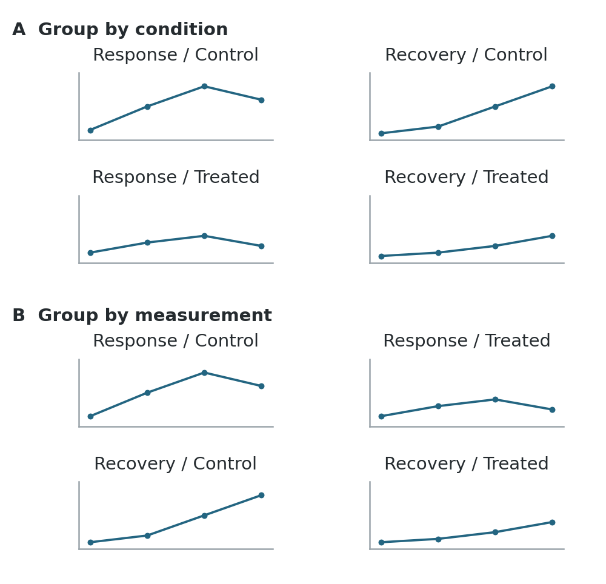
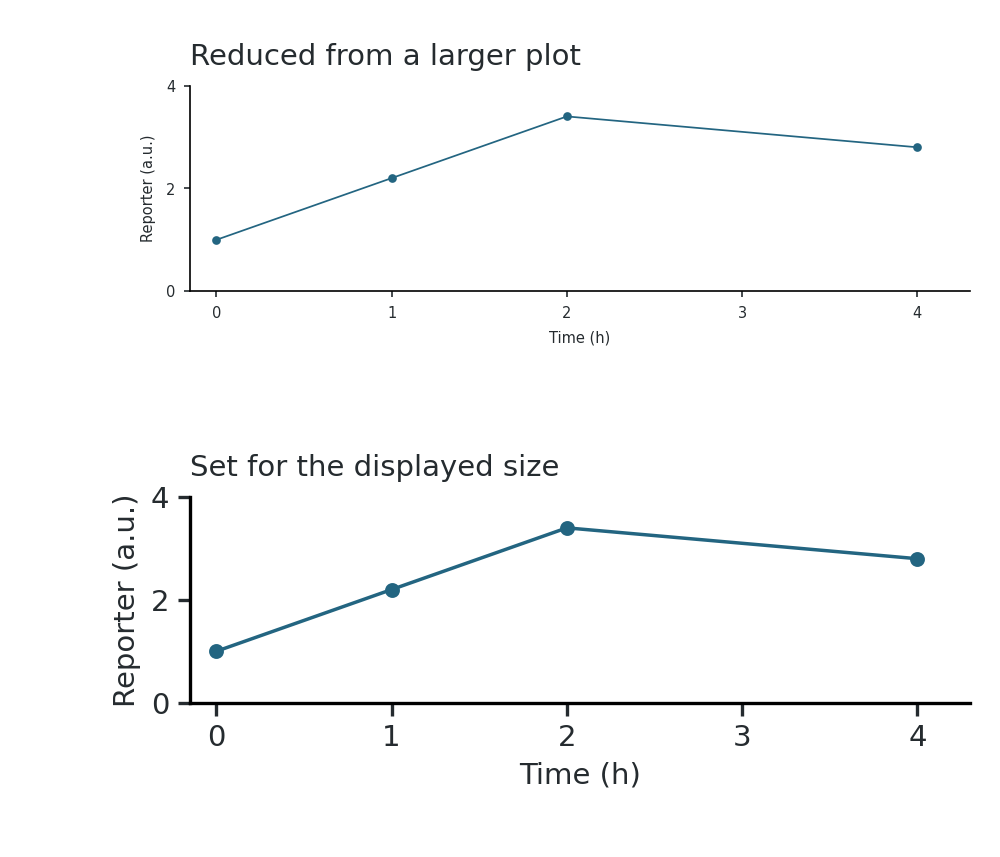

 

# Preparing figures for publication

A figure can look clear on a large editing canvas and become difficult to read when it is reduced to a journal column. Assemble it at its intended publication width. Arrange panels around the comparisons readers need to make, then adjust labels, spacing and graphic weights at that size. [[1]](#ref-layout-wilke2019), chapters 21 and 24.

## Set the publication dimensions

Check the journal’s figure widths before arranging panels. Set the canvas to its intended single-column or full-width size, and allow enough height for the content. At that size, you can judge whether labels remain legible and panels have enough space. [[10]](#ref-layout-froehlichsizing); [[1]](#ref-layout-wilke2019), chapter 24.

## Arrange panels

Sketch the panel arrangement before polishing individual plots. Include space for axis labels, panel letters, keys and annotations. A few rough alternatives make it easier to compare a row, a grid or a larger central panel with smaller supporting panels. [[2]](#ref-layout-wongpencil2012); [[3]](#ref-layout-wonglayout2011).

### Group comparisons

Place panels that readers should compare beside one another. For a treatment comparison across several assays, give each assay a row and each condition a column. If the question instead concerns several measurements within each condition, group those measurements together. Use row and column headings to make the grouping clear. [[4]](#ref-layout-wonggestalt2010), Figure 1; [[1]](#ref-layout-wilke2019), chapter 21.

A figure can also explain a sequence: an experimental design, its results and a summary. Arrange these in a consistent reading order, usually left to right and then down. The layout need not reproduce the order in which experiments were performed. Give a complex plot or image enough room to be read; panels need not all have the same dimensions. [[3]](#ref-layout-wonglayout2011); [[9]](#ref-layout-rougier2014), rules 1–3.

**Group the same panels in two ways**

The same four schematic plots in two arrangements: A groups measurements within each condition; B places control and treated side by side for each measurement.

Use B to compare treatment effects on each measurement; use A to examine response and recovery together within each condition.

### Allocate space

Use alignment guides to line up panel edges and keep gaps consistent. Leave more space between distinct groups of panels than between panels belonging together. The spacing can show which panels belong together without enclosing every group in a box. [[5]](#ref-layout-wongspace2011), Figure 2.

Allow for long labels and keys when deciding panel widths. If they become cramped, change the arrangement or give the figure more space before reducing the text. Preserve the proportions of images and exported plots when resizing them. Stretching one dimension changes the apparent shapes in images and slopes in plots. [[1]](#ref-layout-wilke2019), chapters 21 and 24; [[5]](#ref-layout-wongspace2011).

## Align axes and annotations

### Align plotting areas

Align the plotting areas of comparable panels: their baselines, axis endpoints and tick positions. Aligning the outer edges of imported graphics may leave the actual axes offset because their label margins differ. Use the same axis lengths, ranges and ticks when readers need to compare magnitudes across panels. [[1]](#ref-layout-wilke2019), chapter 21; [[6]](#ref-layout-axes2013).

Different ranges can help when the aim is to examine the shape of each response and their magnitudes differ greatly. In that case, show the scale on every panel and avoid a shared axis label that suggests a common range. Do not remove observations merely to make panels fit the same scale. [[1]](#ref-layout-wilke2019), chapter 21; [[9]](#ref-layout-rougier2014), rule 7.

Keep axes and grid lines lighter than the data, but visible. A few horizontal guides help readers compare heights across a wide plot; a reference line at zero or at no change may be more useful than a full grid. [[6]](#ref-layout-axes2013); [[1]](#ref-layout-wilke2019), chapter 23.

Use concise tick labels and put their common unit or multiplier in the axis title. Avoid repeating a long number prefix at every tick. For aligned panels with an identical scale, one clearly shared axis can replace repeated labels. Keep separate labels where there is any doubt about which scale applies. [[6]](#ref-layout-axes2013), Figure 2.

### Place labels and keys

Give panel letters the same size, weight and position throughout the figure. Keep them distinct from the panel content without making them the most prominent marks. Short panel titles can identify an assay or condition; a row or column heading can replace repeated wording. [[1]](#ref-layout-wilke2019), chapters 21–22.

In a densely labeled diagram, arrange labels around the graphic and use short leader lines where a label’s target would otherwise be ambiguous. Keep the leaders from crossing or covering important features. [[7]](#ref-layout-labels2013), Figures 1–3.

Keep group names and ordering consistent across panels. A color or symbol should identify the same group wherever it appears. Use one shared key when its entries mean the same thing everywhere; keep it near the panels it explains. Put the information needed to identify a curve or image on the figure, and the longer methodological explanation in the [figure legend](../04-writing-a-paper/03-methods-results-and-figure-legends.md#reporting-legends). [[1]](#ref-layout-wilke2019), chapters 21–22; [[9]](#ref-layout-rougier2014), rule 4.

For a small table within a figure, align text to the left and comparable numbers to the right or by their decimal points. Use consistent precision and put units in the headings. Space between columns and a rule beneath the header are often sufficient; subtle row shading can help readers follow a wide table. [[1]](#ref-layout-wilke2019), chapter 22.

## Set text and graphic weights

Use one typeface and a small set of sizes: one for ordinary labels and a distinct treatment for panel letters or headings. Reserve bold and italic for a clear purpose, including the scientific conventions for gene names and mathematical notation. When combining plots from different programs, standardize their typography after placing them at the intended size. [[8]](#ref-layout-wongtype2011); [[1]](#ref-layout-wilke2019), chapter 24.

Judge text, symbols and line weights together. Large axis labels can dominate a plot whose data points are small and hard to see. Thick lines can obscure nearby observations; very thin ones can disappear on reduction. Check subscripts, superscripts, error-bar caps and dashed lines as well as the main labels. [[1]](#ref-layout-wilke2019), chapter 24; [[9]](#ref-layout-rougier2014), rule 3.

**Practical starting settings**

Set these values at the final publication size, then adjust them to the journal’s specifications. [[10]](#ref-layout-froehlichsizing).

<table>
<colgroup>
<col>
<col>
</colgroup>
<thead>
<tr>
<th>Element</th>
<th>Starting setting</th>
</tr>
</thead>
<tbody>
<tr>
<td>Ordinary labels, ticks and keys</td>
<td>Arial or Helvetica, 7 pt; avoid text below 6 pt.</td>
</tr>
<tr>
<td>Panel letters</td>
<td>8 pt, bold and upright.</td>
</tr>
<tr>
<td>Plot lines and axes</td>
<td>At least 0.5 pt; avoid hairlines below 0.25 pt. Increase weight where the line must stand out.</td>
</tr>
<tr>
<td>Sequence labels</td>
<td>A monospaced font, such as Courier, when character alignment matters.</td>
</tr>
<tr>
<td>Figure dimensions</td>
<td>Set the canvas to the journal’s single-column or full-width dimensions before arranging panels. Let the content determine height.</td>
</tr>
</tbody>
</table>

**Resizing a plot also resizes its text and marks**

The same invented reporter trace at the same panel size. The upper plot retains text and marks from a larger graphic reduced by half; the lower plot is set for the displayed size.

Set the plotting canvas to the required width before export, or account for the reduction when choosing sizes. If readable labels leave too little room for the data, enlarge the panel, rearrange the figure or split it. Judge this at reading size rather than zoomed in. [[1]](#ref-layout-wilke2019), chapter 24.

Check the intended journal’s current figure instructions for permitted dimensions, type sizes and line weights. A slide usually needs larger text, stronger lines and fewer simultaneous details than a manuscript figure, because the audience sees it briefly and from a distance. Prepare a separate slide version where necessary. [[9]](#ref-layout-rougier2014), rule 3.

## Export and inspect

Use a font with the required Greek and mathematical characters, and check for substitutions in the exported file. Keep RGB while designing unless the destination specifies otherwise; inspect any required color conversion before submission. [[10]](#ref-layout-froehlichsizing).

### Choose formats and resolution

Keep plots, text and diagrams as vector elements when the destination accepts them. They can be resized without pixelating and remain easier to edit. Photographs and microscopy images remain raster images even when placed inside a PDF or SVG. A dense scatterplot may be easier to display as a raster layer with vector axes and labels. [[1]](#ref-layout-wilke2019), chapter 27.

For raster export, use a lossless format such as PNG or TIFF for figures containing text, lines or sharp boundaries. JPEG compression can produce visible artifacts around these features. Saving a low-resolution screenshot as a PDF does not restore vector lines or recover image detail. [[1]](#ref-layout-wilke2019), chapter 27.

Keep an editable master and export submission copies from it. Where plots are produced by code, correct labels or data in that code and regenerate them. Use the assembly file for arrangement and annotation, rather than manually moving data points or redrawing results. Embed fonts when the format permits, and reopen the export to check for substituted characters, missing symbols or changed spacing. [[1]](#ref-layout-wilke2019), chapter 27; [[9]](#ref-layout-rougier2014), rules 7 and 10.

Raster resolution depends on the number of pixels and the size at which the image is placed. Calculate it from:

**Pixels needed = final width in inches × required pixels per inch.**

For example, a 4-inch-wide raster figure requires 1,200 pixels across at 300 pixels per inch. Use the destination’s required resolution in this calculation. [[1]](#ref-layout-wilke2019), chapter 27.

Inspect transparency, gradients and any raster layers in the exported file. Retain the original images and editable figure when a journal requires a flattened submission copy. [[1]](#ref-layout-wilke2019), chapter 27; [[9]](#ref-layout-rougier2014), rule 3.

### Check the exported file

Open the exported figure at its intended physical size, ideally also in the assembled manuscript. Inspect it closely for clipping, missing marks and raster artifacts, then return to normal reading size. Ask a colleague to identify the main comparison and explain the panels without your spoken guidance; revise any grouping or labels they misread. [[9]](#ref-layout-rougier2014), rules 4 and 7; [[1]](#ref-layout-wilke2019), chapters 24 and 27.

**Before submission**

- Related panels sit together, with a clear reading order and enough room for labels.

- Comparable plots have aligned axes and consistent scales; any differences are explicit.

- Panel letters, group names, keys and the caption agree.

- Text, symbols and lines remain readable at the final size; color and accessibility have been [checked](03-color-symbols-and-accessibility.md#color-check).

- The exported file has no clipped labels, substituted fonts or degraded images and meets the destination’s specifications.

## References

Original teaching graphics; the reporter trace is invented.

1. [Wilke, C. O. (2019). **Fundamentals of Data Visualization.** O’Reilly Media. Chapters 21–24 and 27.](https://clauswilke.com/dataviz/)

2. [Wong, B., & Kjærgaard, R. S. (2012). **Pencil and paper.** *Nature Methods*, 9, 1037.](https://doi.org/10.1038/nmeth.2223)

3. [Wong, B. (2011a). **Layout.** *Nature Methods*, 8, 783.](https://doi.org/10.1038/nmeth.1711)

4. [Wong, B. (2010). **Gestalt principles (Part 1).** *Nature Methods*, 7, 863.](https://doi.org/10.1038/nmeth1110-863)

5. [Wong, B. (2011b). **Negative space.** *Nature Methods*, 8, 5.](https://doi.org/10.1038/nmeth0111-5)

6. [Krzywinski, M. (2013a). **Axes, ticks and grids.** *Nature Methods*, 10, 183.](https://doi.org/10.1038/nmeth.2337)

7. [Krzywinski, M. (2013b). **Labels and callouts.** *Nature Methods*, 10, 275.](https://doi.org/10.1038/nmeth.2405)

8. [Wong, B. (2011c). **Typography.** *Nature Methods*, 8, 277.](https://doi.org/10.1038/nmeth0411-277)

9. [Rougier, N. P., Droettboom, M., & Bourne, P. E. (2014). **Ten Simple Rules for Better Figures.** *PLOS Computational Biology*, 10, e1003833.](https://doi.org/10.1371/journal.pcbi.1003833)

10. [Froehlich, J. (n.d.). **Research figures: practical formatting targets.** *Awesome Life Science Resources*, GitHub. Accessed September 18, 2026.](https://github.com/jjfroehlich/awesome-life-science-resources/blob/main/pages/figure-fonts-sizing.md)
