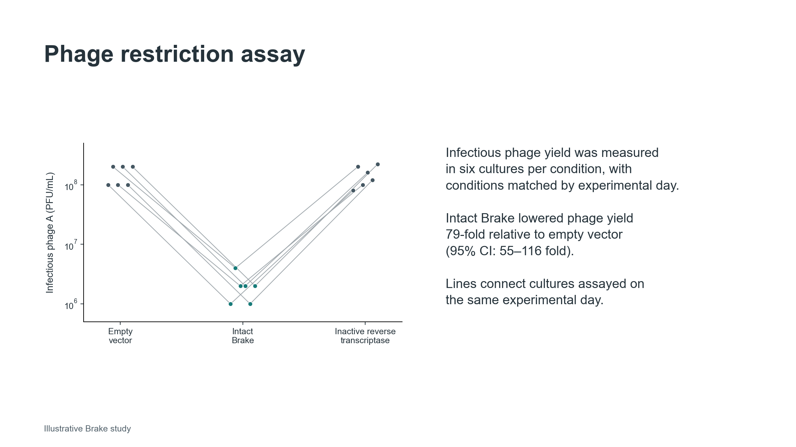

 

# Designing a presentation

Before polishing individual slides, arrange the questions and results into a sequence your audience can follow. Work out what listeners need to understand before each experiment appears.

## Plan the sequence

Write a short sentence for each main point and place the supporting results beneath it. Arrange these groups so that each result answers a question the audience already understands. Add the background and experimental design needed to interpret it. A research talk will often move from the biological problem through a few connected questions to the answer and its implications. A lab meeting about a proposed experiment may instead compare designs and end with a decision for discussion. [[1]](#ref-slide-nsestructure); [[2]](#ref-slide-broadslides).

Sketch each slide with a proposed title, its figure or diagram, and a note about what you will say. Paper, a whiteboard or an unformatted slide list all work. Then read the titles in order. If one finding does not lead clearly to the next question, add the missing explanation or rearrange the slides before working on their layout. [[4, pp. 26–40]](#ref-slide-duarte2008).

The following four-slide sequence uses the fictional Brake study. It introduces the unfamiliar route before asking listeners to interpret the decisive experiments.

**Example: a connected four-slide storyboard**

**Slide 1: Brake restricts phage propagation although no effector gene is annotated**

**On screen:** A compact locus diagram labels the reverse transcriptase and RNA template; the missing conventional effector is marked as the puzzle.

**Spoken transition:** “If there is no ordinary effector gene, how does this system restrict phage propagation?”

**Slide 2: The RNA template is copied into DNA that encodes a protein**

**On screen:** Introduce the RNA template, then add the single-stranded DNA detected before infection, followed by the double-stranded DNA and protein detected during infection. Keep earlier elements visible and label when each product was observed.

**Spoken transition:** “This gives us a possible route to defence. Does defence depend on the enzyme that makes this DNA?”

**Slide 3: Brake reduces infectious phage yield, and reverse transcription is required**

**On screen:** Show the three-condition culture plot at readable size: empty vector, intact Brake and inactive reverse transcriptase, with matched days retained.

**Spoken transition:** “Reverse transcription is necessary. Next, we need to test the protein’s role while leaving DNA production intact.”

**Slide 4: The encoded protein is required for defence**

**On screen:** Show that disrupting translation leaves DNA production intact but loses defence, and that expressing the protein separately restores defence. Conclude that the protein is required for defence; its molecular target remains unknown.

**Spoken transition:** “So Brake uses an RNA template to make the gene for a defence protein. The genetic tests establish the protein’s role, but we still do not know its molecular target.”

The third slide can use the quantitative plot below. The fourth needs the translation-disruption and restoration results: the three-condition culture plot alone cannot establish the protein’s role.

Decide which details belong in the main talk and which can be reserved for questions. A control that distinguishes two explanations belongs with the result it supports; an extended protocol can usually wait unless the method itself is under discussion. End with the answer to the opening question and its significance. Keep this conclusion visible during questions, with acknowledgments on the preceding slide or alongside it. [[1]](#ref-slide-nsestructure); [[3, Rules 4–5]](#ref-slide-naegle2021).

Allow more time for an unfamiliar experiment than for a short transition. A fixed slides-per-minute target is unreliable when some slides build a diagram and others contain several comparisons. Determine the length by [rehearsing the explanation aloud](03-delivering-a-talk-and-answering-questions.md#delivery-rehearse). [[5]](#ref-slide-reynolds2012); [[1]](#ref-slide-nsestructure).

## Give each slide a clear message

Use the title to state the finding or question. “Brake reduces the yield of infectious phage A” tells listeners what to look for; “Phage restriction assay” names only the experiment. A question works well when the slide introduces a test or asks colleagues to consider an unresolved choice. Keep the title short enough to read at a glance and specific enough to describe the evidence below it. [[3, Rule 3]](#ref-slide-naegle2021); [[2]](#ref-slide-broadslides).

Choose one main message for the slide, then include the comparisons needed to establish it. This may require two related plots, an image and its quantification, or a schematic beside the result. If the slide contains several independent conclusions, split it. Keep plots together when listeners need to compare them directly. [[3, Rules 1 and 5]](#ref-slide-naegle2021).

Write the spoken explanation in your notes. On the slide, retain the title, labels and brief annotations that help people interpret the visual. Replace a paragraph describing an experimental sequence with a diagram when the sequence is easier to see than to read. Short text can still be the best choice for a definition, a question or a small set of alternatives; a decorative image adds little. [[3, Rules 6 and 8]](#ref-slide-naegle2021); [[4]](#ref-slide-duarte2008).

## Adapt figures for live viewing

Prepare a presentation version of a manuscript figure. Select the relevant panels, enlarge the labels and place brief explanations beside the features you will discuss. Keep the units, controls, observations and uncertainty needed to assess the claim. If these cannot fit legibly, spread the explanation across slides rather than shrinking the complete publication figure. [[2]](#ref-slide-broadslides); [[4, pp. 64–77]](#ref-slide-duarte2008).

For an unfamiliar assay or display, first explain the experimental comparison and how to read the result. A small schematic or an illustration of the expected patterns can help. Distinguish predictions from measurements. For a familiar plot, a brief spoken orientation to the conditions and axes may be enough. [[2]](#ref-slide-broadslides).

The following slides use the fictional Brake study, inspired by Tang and colleagues (2024) [[6]](#ref-slide-tang2024). Brake is a bacterial defence system containing a reverse transcriptase. The experiment compares the infectious yield of phage A from cultures carrying an empty vector, intact Brake or Brake with an inactive reverse transcriptase.

**Example: turning a manuscript result into a slide**

A draft slide with a method-based title, a small three-condition graph and a manuscript-style explanation beside it.

The revised slide enlarges the same observations and states the finding in the title. The annotation reports a 79-fold reduction in infectious phage A yield versus empty vector (95% CI: 55–116 fold).

Both slides retain all observations, day matching and the inactive-enzyme control. The revised slide gives more space to the comparison and replaces the paragraph with labels. The presenter can explain how the cultures were assayed while listeners inspect the result. The control remains visible, although the numerical estimate refers specifically to Brake versus empty vector.

Original teaching figure; all plotted values are illustrative.

Highlight the condition or region you are discussing while keeping the other evidence visible. Across slides, preserve condition colors, axis limits and plot positions when viewers need to compare results. If a scale changes, make the change explicit. [[4, pp. 70–75]](#ref-slide-duarte2008).

## Make the slide readable

Build a simple layout with a consistent title position, generous margins and aligned visual elements. Put labels next to what they describe and separate unrelated groups with space. Give the central figure most of the slide rather than squeezing it between a large institutional banner and a long caption. [[4, pp. 92–110]](#ref-slide-duarte2008).

Check the smallest essential label at the size and distance the audience will see it. A graph that is readable on your laptop may fail on a projector or in a shared screen. Increase the figure and its labels together; enlarging the title alone does not help. If the slide is still crowded, remove a secondary point or split the explanation. [[3, Rules 6–7]](#ref-slide-naegle2021).

Use strong text–background contrast and consistent sizes for titles, labels and annotations. Pair color with labels, symbols or line styles so that viewers can distinguish conditions with poor projection or differences in color vision. Avoid placing text directly over a photograph; put it on a solid background if the image interferes with reading. For ways to distinguish groups without relying on color alone, see [Color, symbols and accessibility](../03-data-visualization/03-color-symbols-and-accessibility.md#color-chapter). [[3, Rule 7]](#ref-slide-naegle2021).

## Use builds and prepare the shared version

Reveal a complex diagram in stages when you need to explain its parts in sequence. Keep the existing elements in place as new ones appear. A few duplicate slides with additional labels or arrows are often easier to edit and export than a complicated animation. Check every copy after a revision so that an old label or value does not reappear. For a comparison that requires simultaneous inspection, show both alternatives together. [[3, Rule 1]](#ref-slide-naegle2021); [[4, pp. 180–191]](#ref-slide-duarte2008).

Use video or animation when motion, timing or a change in state is part of the explanation. Plan where to pause and what to point out. Keep a still image or short sequence that supports the explanation if playback fails, and test the exported deck as well as the editable file. [[3, Rule 10]](#ref-slide-naegle2021).

Credit published figures and ideas on the slide where they appear, and identify collaborators’ contributions. A compact author–year reference can point to full details in the notes or reference slides; retain any required image credit. For unpublished work, agree with collaborators what can be shown and shared. [[3, Rule 4]](#ref-slide-naegle2021).

If people will read the deck afterward, add the explanations they would otherwise hear from you in notes or a companion document. Check that the shared file includes those notes or explanations, and that diagrams revealed in stages can still be followed in the exported format. [[5]](#ref-slide-reynolds2012); [[3, Rules 8 and 10]](#ref-slide-naegle2021).

Before rehearsal, review the sequence in slide-sorter view. Then display the slides at presentation size to check small labels and crowded figures.

## References

1. [NSE Communication Lab. (n.d.-a). **Structuring a Slide Presentation.** MIT Communication Lab. Contributors: Steve Jepeal and Charlie Hirst.](https://mitcommlab.mit.edu/nse/commkit/structuring-a-slide-presentation/)

2. [Broad Communication Lab. (n.d.). **Slideshow.** MIT Communication Lab. Contributors: Nav Ranu and Martin Stewart.](https://mitcommlab.mit.edu/broad/commkit/slideshow/)

3. [Naegle, K. M. (2021). **Ten simple rules for effective presentation slides.** *PLOS Computational Biology*, 17(12), e1009554.](https://doi.org/10.1371/journal.pcbi.1009554)

4. [Duarte, N. (2008). **slide:ology: The Art and Science of Creating Great Presentations.** O’Reilly Media.](https://www.oreilly.com/library/view/slide-ology/9780596522346/)

5. [Reynolds, G. (2012). **Presentation Zen: Simple Ideas on Presentation Design and Delivery.** Second edition. New Riders.](https://ptgmedia.pearsoncmg.com/images/9780321811981/samplepages/0321811984.pdf)

6. [Tang, S., and colleagues (2024). **De novo gene synthesis by an antiviral reverse transcriptase.** *Science*, 386(6717), eadq0876.](https://doi.org/10.1126/science.adq0876)
